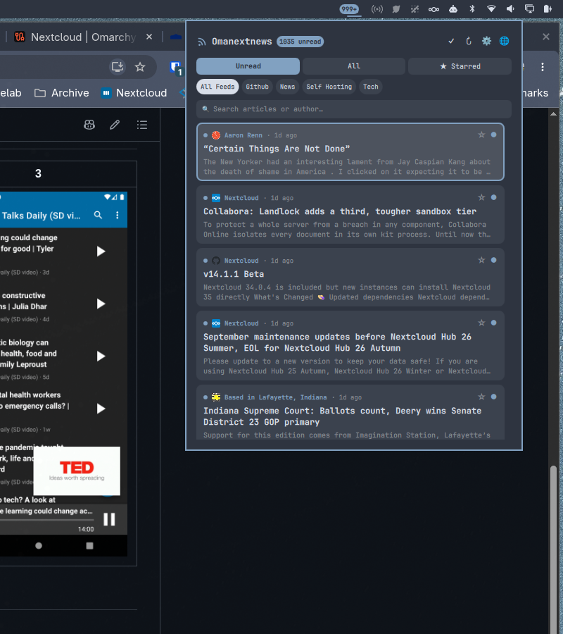

# Omanextnews for Omarchy

<p align="center">
  
</p>

An Omarchy status bar widget and sliding news reader panel replicating [Nextcloud News for Android](https://github.com/nextcloud/news-android).

**Omanextnews** syncs your RSS and Atom feeds directly from your Nextcloud server, provides a live unread badge in your status bar, caches articles locally in SQLite for instant offline reading, and features a smooth animated sliding reader view with podcast/audio playback.

---

## Features

- **Direct Browser Sign-in (Nextcloud Login Flow v2)**: No desktop client required! Click "Sign in with Browser", grant access in the browser tab, and the plugin automatically captures an app token.
- **Desktop Client Auto-detection**: If you run the Nextcloud Desktop client, it seamlessly detects your credentials from the system keyring (`secret-tool`).
- **Animated Sliding View**: Smooth horizontal transitions between the article feed list and the full reader view. Press `Enter` to slide into the reader; press `Escape` or `h` to slide back to your exact list position.
- **Live Status Bar Badge**: Real-time unread article counter with sync pulsing animations and error indications.
- **Offline Caching**: Feeds, folders, and articles are cached in a local SQLite database (`~/.cache/omarchy/plugins/clartek.omanextnews/news.db`).
- **Podcast Enclosure Player**: Audio feeds display a one-click button to play episodes via MPV.
- **Full Keyboard Navigation**:
  - `j` / `k` (or `↓` / `↑`): Navigate articles
  - `Enter`: Open article in reader
  - `Escape` or `h`: Return to article list
  - `r`: Toggle read / unread
  - `s`: Toggle star / bookmark
  - `m`: Mark all as read
  - `o`: Open article link in default browser
  - `u` / `a` / `b`: Switch filter between Unread, All, and Starred
  - `p`: Play podcast enclosure via `mpv`
- **Folders & Search**: Filter by folders (*News*, *Tech*, *Github*, etc.) or search on-the-fly.

---

## Installation & Setup

Install or enable the plugin in your Omarchy shell:

```bash
omarchy plugin enable clartek.omanextnews --section right
```

Or move it on the bar:

```bash
omarchy bar move clartek.omanextnews --section right
```

Reload the shell:

```bash
omarchy-shell shell rescanPlugins
```

---

## License

MIT License - Copyright (c) 2026 clartek
